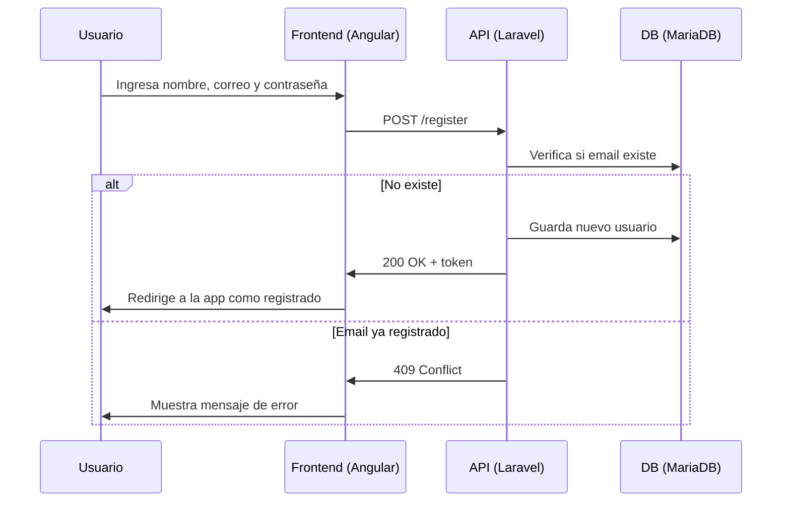
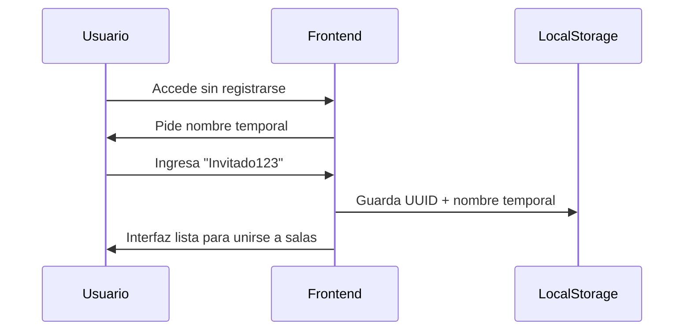
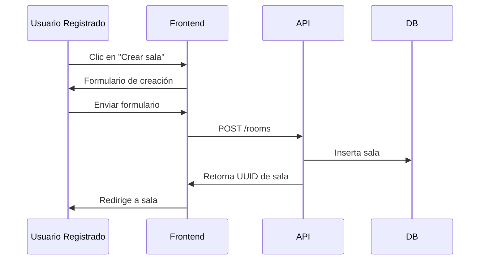
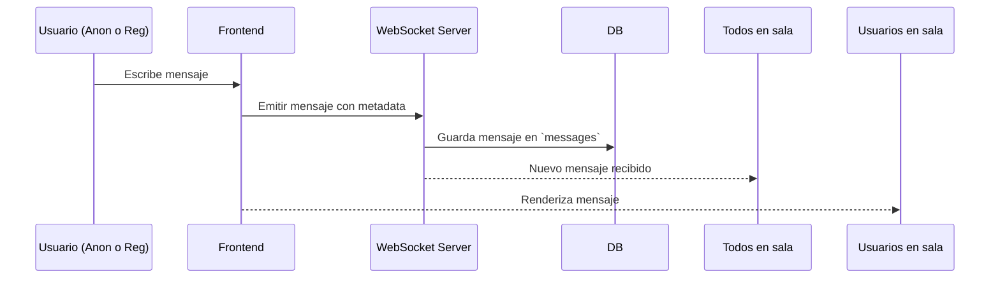
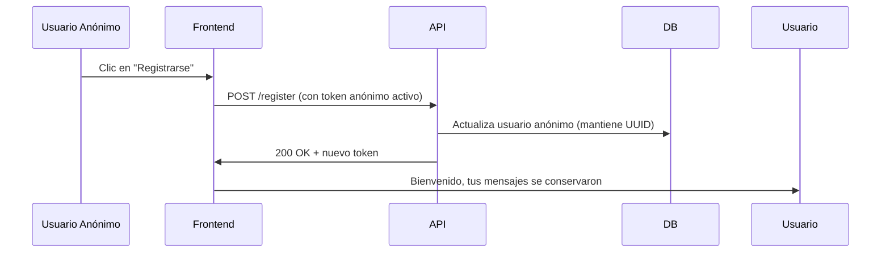
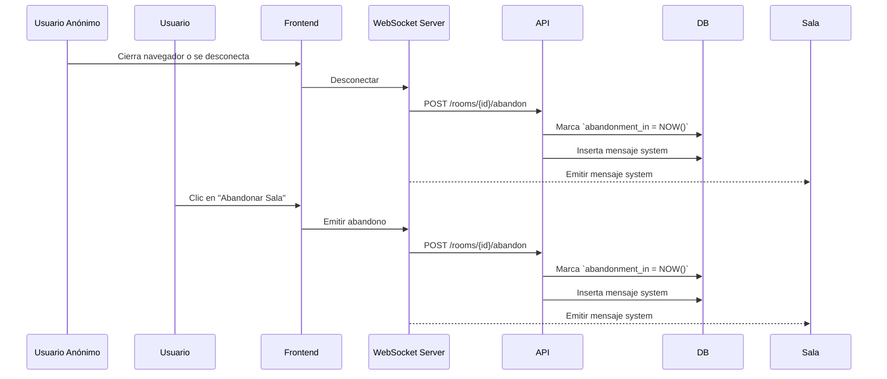

# 🧠 Chat App – Proyecto de Programación Web II

Autor: **Jhoel Cruz**  
Universidad: **UPDS** – 6to Semestre de Ingeniería de Sistemas  
Materia: **Programación Web II**

---

## 📘 Descripción del proyecto

Esta aplicación es una plataforma de **chat en tiempo real** desarrollada como proyecto universitario. Combina tecnologías modernas como **PHP (Laravel)**, **MariaDB**, **WebSockets**, y **Angular** para ofrecer un sistema completo de salas de chat que permite:

- Chatear en **salas públicas o privadas**
- Soporte para **usuarios anónimos** o **registrados**
- Diferentes **tipos de mensajes** (texto con Markdown, imágenes, audio, video y documentos)
- Funcionalidad en **tiempo real** con WebSockets
- Persistencia de mensajes para usuarios registrados
- Registro en caliente: un usuario anónimo puede registrarse y conservar sus mensajes

---

## 🛠️ Tecnologías utilizadas

| Componente    | Tecnología                                           |
| ------------- | ---------------------------------------------------- |
| Backend       | Laravel 12.x (PHP 8.4)                               |
| Base de datos | MariaDB 10.x                                         |
| Realtime      | Laravel WebSockets (`beyondcode/laravel-websockets`) |
| Frontend      | Angular 20.x                                         |
| Comunicación  | API REST y WebSocket                                 |

---

## 🗃️ Modelo de Base de Datos

### 📊 Diagrama Entidad-Relación

El sistema utiliza un modelo relacional optimizado para manejar salas de chat en tiempo real con soporte para usuarios anónimos y registrados.

**🔗 [Ver diagrama interactivo en DBDiagram.io](https://dbdiagram.io/d/Chat-67801be46b7fa355c36ede4b)**

### 📋 Entidades principales

| Tabla | Descripción | Campos clave |
|-------|-------------|--------------|
| `users` | Usuarios del sistema (anónimos y registrados) | `id`, `name`, `email`, `is_anonymous` |
| `rooms` | Salas de chat públicas y privadas | `id`, `name`, `is_private`, `allow_anonymous` |
| `room_user` | Relación usuarios-salas con historial | `room_id`, `user_id`, `joined_at`, `abandonment_in` |
| `messages` | Mensajes de todas las salas | `id`, `room_id`, `user_id`, `type`, `content` |
| `files` | Archivos multimedia compartidos | `id`, `user_id`, `path`, `original_name` |

### 🔑 Características del modelo

- **UUID como clave primaria**: Para usuarios y salas, garantizando unicidad global
- **Soporte multimodal**: Mensajes de texto, imágenes, audio, video y documentos
- **Historial completo**: Registro de entrada/salida de usuarios en salas
- **Flexibilidad de usuarios**: Mismo modelo para anónimos y registrados
- **Mensajes del sistema**: Para notificaciones automáticas (unirse/abandonar)

<details>
<summary>🧩 Código DBML completo</summary>

```dbml
Table users {
  id uuid [pk]
  name varchar
  email varchar [unique, null]
  password varchar [null]
  is_anonymous boolean [default: false]
  created_at datetime
  updated_at datetime
}

Table rooms {
  id uuid [pk]
  name varchar
  description text
  is_private boolean [default: false]
  allow_anonymous boolean [default: true]
  created_by uuid [ref: > users.id]
  created_at datetime
  updated_at datetime
}

Table room_user {
  id int [pk, increment]
  room_id uuid [ref: > rooms.id]
  user_id uuid [ref: > users.id]
  joined_at datetime
  abandonment_in datetime [null, default: null]
}

Table messages {
  id bigint [pk, increment]
  room_id uuid [ref: > rooms.id]
  user_id uuid [ref: > users.id]
  type enum('text', 'image', 'image_with_text', 'audio', 'video', 'document', 'system')
  content text
  markdown boolean [default: false]
  reply_to bigint [ref: > messages.id]
  created_at datetime
}

Table files {
  id bigint [pk, increment]
  user_id uuid [ref: > users.id]
  path varchar
  original_name varchar
  mime_type varchar
  size int
  created_at datetime
}
```
</details>
---

## 🔄 Diagramas de Flujo del Sistema

A continuación se detallan los **6 flujos principales** del sistema, modelados con diagramas de secuencia para mostrar cómo interactúan los componentes en tiempo real.

### 1️⃣ Crear cuenta de usuario

### 2️⃣ Usuario anónimo elige nombre temporal

### 3️⃣ Usuario crea una sala



### 4️⃣ Chatear normalmente en una sala


### 5️⃣ Usuario anónimo se registra y conserva sus mensajes

### 6️⃣ Usuario abandona sala o pierde sesión

---

## 🎯 Objetivos del Sistema

| Objetivo | Estado | Descripción |
|----------|---------|-------------|
| ✅ **Tecnologías modernas** | Logrado | Laravel 12, Angular 20, WebSockets, MariaDB |
| ✅ **Sistema escalable** | Logrado | Arquitectura multicomponente con API REST |
| ✅ **Tiempo real** | Planificado | Comunicación WebSocket bidireccional |
| ✅ **Sin registro forzado** | Logrado | Soporte completo para usuarios anónimos |
| ✅ **Base para futuras mejoras** | Logrado | Reacciones, emojis, notificaciones, etc. |

---

## 📌 Estado del proyecto

| Componente | Estado | Descripción |
|------------|--------|-------------|
| Modelo de datos | ✅ **Finalizado** | Diagrama ER y estructura DBML completa |
| Diagramas UML | ✅ **Completado** | 6 diagramas de secuencia documentados |
| Backend API | 🔜 **En desarrollo** | Laravel + MariaDB + API REST |
| WebSocket | 🔜 **En desarrollo** | Comunicación en tiempo real |
| Frontend | 🔜 **Pendiente** | Angular 20.x + Material Design |

---

💬 Créditos
Este proyecto fue desarrollado por Jhoel Cruz, estudiante de la Universidad Privada Domingo Savio (UPDS), como parte del curso de Programación Web II, con fines educativos y de aprendizaje profesional.
